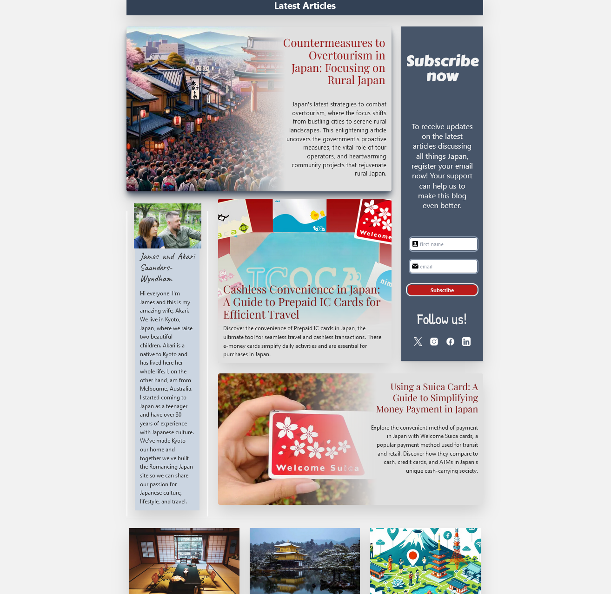
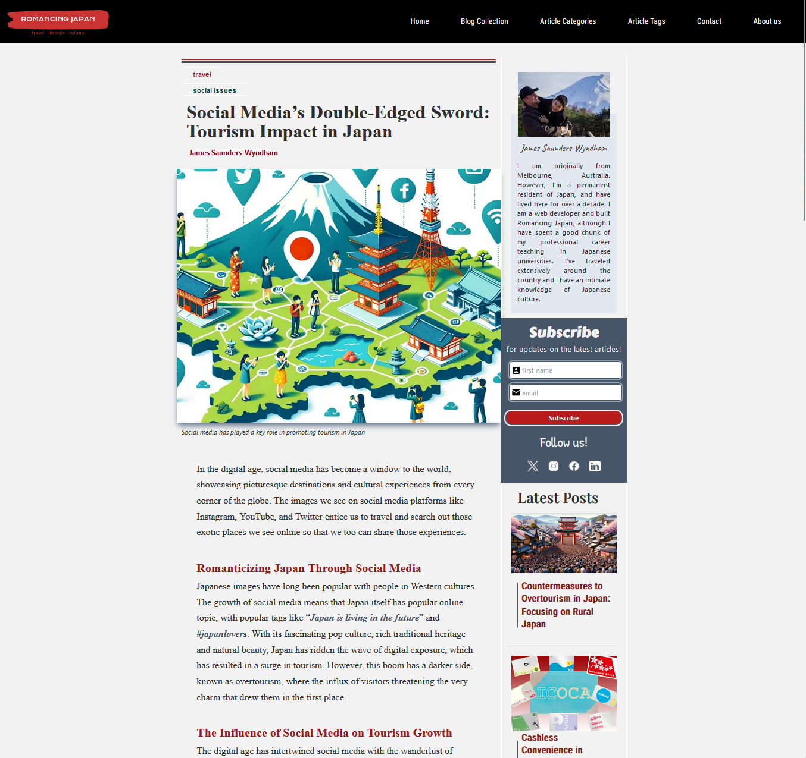

# Romancing Japan

Welcome to [Romancing Japan](https://www.romancing-japan.com/), a comprehensive platform dedicated to exploring the beauty and intricacies of Japan. This site is crafted with Next.js and styled using Tailwind CSS, offering a modern, responsive user experience. With Sanity.io powering the backend, the site delivers dynamic content seamlessly.

## Screenshots

### Homepage

*The homepage showcases featured articles and latest updates.*

### Article View

*Articles are rich with images and detailed insights.*

## Features

- **Engaging Content**: Dive into a rich collection of articles and stories that bring Japan's culture, traditions, and modern lifestyle closer to you.
- **Responsive Design**: Experience a smooth, user-friendly interface on any device, thanks to the responsive design powered by Tailwind CSS.
- **Dynamic Updates**: Stay updated with the latest content on Japanese culture, travel tips, and more, dynamically managed and updated through Sanity.io.
- **Immersive Visuals**: Enjoy high-quality images and videos that provide a visual treat and an immersive experience into various aspects of Japan.
- **Intuitive Navigation**: Easily explore different sections of the site, designed for an intuitive user journey through the beautiful landscape of Japan.

## Built With

- [**Next.js**](https://nextjs.org/): A React framework that enables functionality such as server-side rendering and generating static websites for React-based web applications.
- [**Tailwind CSS**](https://tailwindcss.com/): A utility-first CSS framework packed with classes like flex, pt-4, text-center, and rotate-90 that can be composed to build any design, directly in your markup.
- [**Sanity.io**](https://www.sanity.io/): A platform for structured content that comes with an open-source editing environment called Sanity Studio that you can customize with JavaScript and a real-time hosted data store.

## Exploring Romancing Japan

Dive into the world of "Romancing Japan" and explore a variety of topics from the majestic Mount Fuji to the bustling streets of Tokyo. Whether you're planning a trip to Japan or just curious about its rich culture, our website is your gateway to the Land of the Rising Sun.

Enjoy your journey through Romancing Japan!
